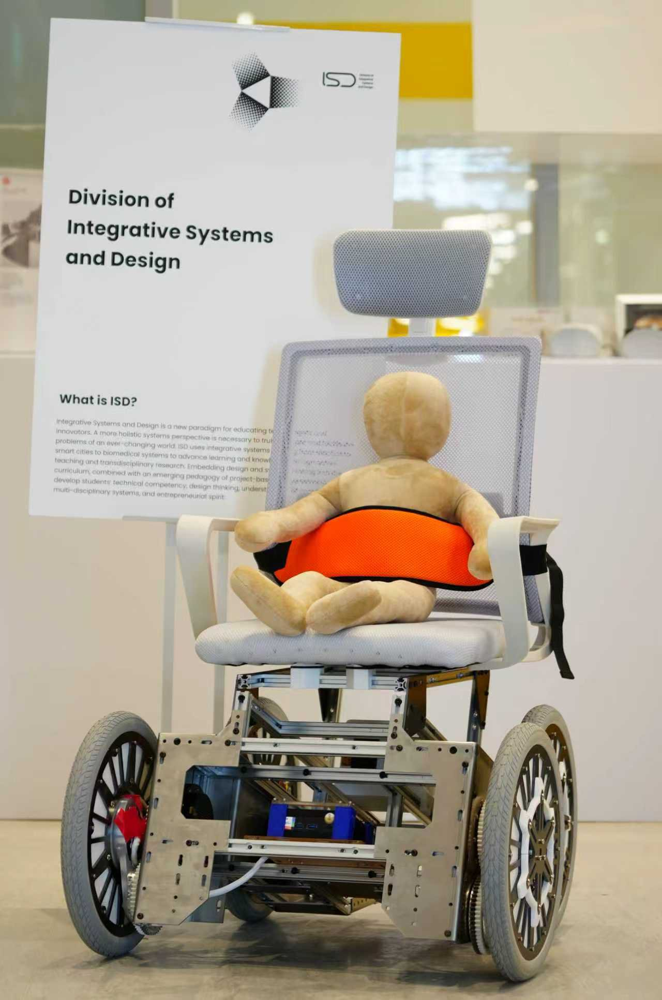
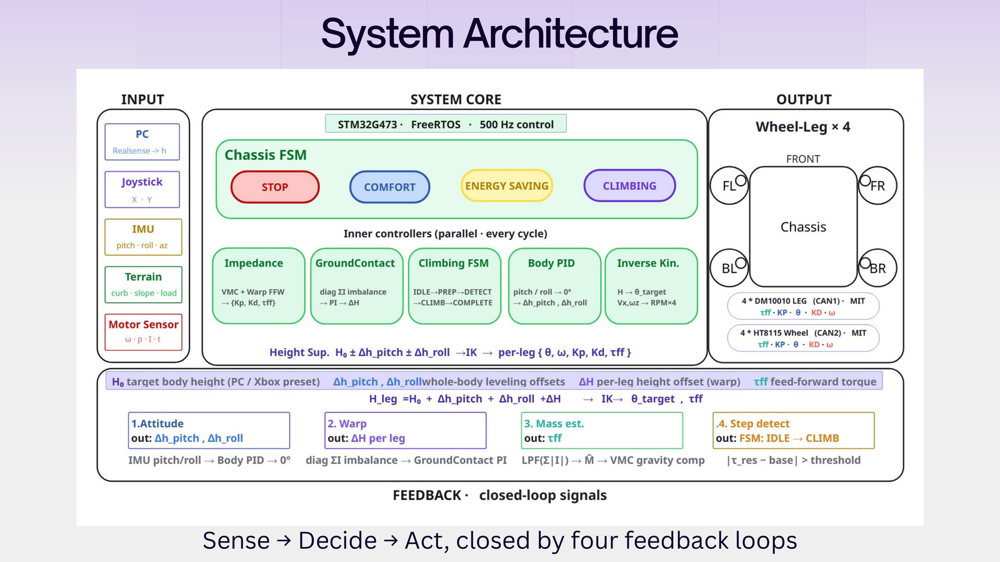
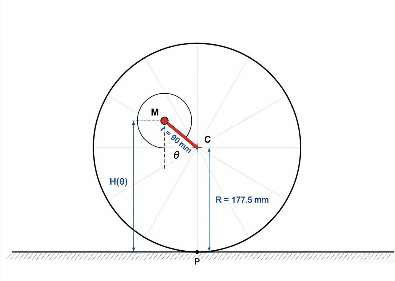
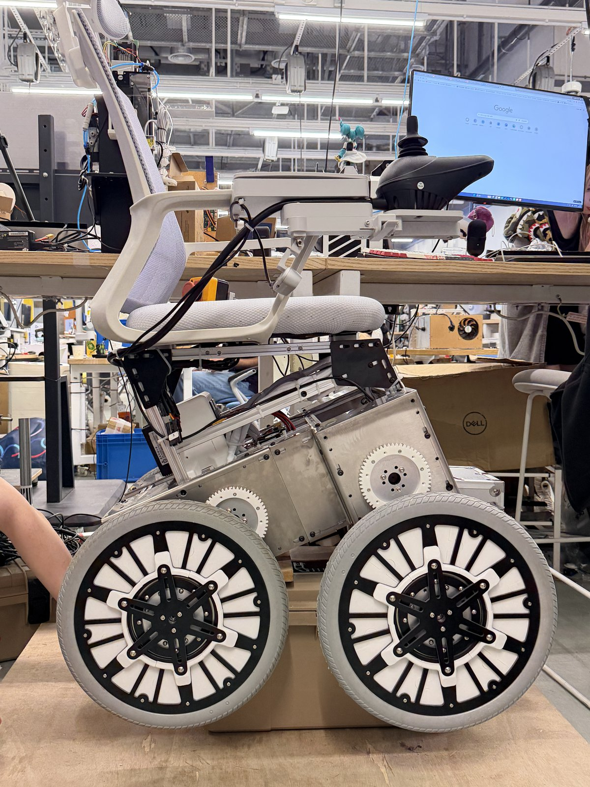
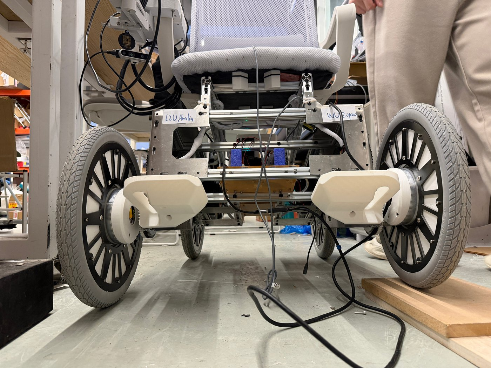
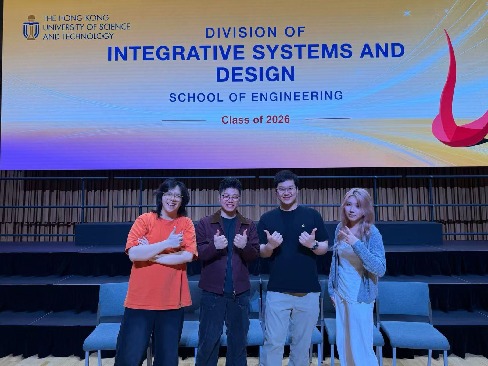

# Circle_Leg_V2 — REACHABLE (QuadCirc) Full-Size Wheel-Leg Wheelchair Firmware

<p align="center">
  
  
  
  
  
</p>

<p align="center">
  <b>English</b> | <a href="README_zh.md">中文</a>
</p>

<p align="center">
  
</p>
<p align="center"><sub>The full-size prototype on display at HKUST ISD</sub></p>

Embedded control firmware for the **full-size REACHABLE (QuadCirc) electric wheelchair**. It has four
**CircLeg** eccentric wheel-leg modules. Each one rolls as an ordinary wheel on flat ground and turns
into a stepping leg to lift the chassis over the 5–18 cm curbs, thresholds and single steps that
wheelchair users meet every day. HKUST Final Year Design Project **SL05a-25** (2025–2026).

---

## Overview

Each CircLeg puts the wheel hub at an eccentric offset *r* inside a wheel of radius *R*. Rotating
the hub raises or lowers that corner of the chassis, and the wheel stays in contact with the ground
the whole time. With only **two motors per corner** (one wheel motor, one leg motor), the firmware:

- **Drives** like a normal wheelchair: skid-steer inverse kinematics for the trapezoidal chassis,
  four D-pad speed tiers, acceleration limits and smoothing.
- **Rides comfortably (COMFORT mode):** variable-impedance active suspension that maps a virtual
  Cartesian spring-damper to per-leg MIT gains, IMU body leveling, an online mass estimate, and
  **warp** (diagonal-twist) compensation that keeps all four wheels grounded.
- **Climbs steps (CLIMBING mode):** a per-leg state machine that detects step contact from the
  motor **torque residual** plus the wheel-speed drop, then follows a purely geometric climbing
  trajectory. The front pair climbs first and the back pair follows.
- **Stays safe:** host link-loss detection (500 ms), smooth mode transitions, singularity clamping,
  and live-tunable debug structs for SEGGER Ozone.

Related repositories:

| Repository | Content |
|------------|---------|
| **Circle_Leg_V2** (this repo) | Firmware for the full-size prototype (final deliverable), PCB and CAD |
| [Circle_Leg_V1.0](https://github.com/QuadCirc-Reachable/Circle_Leg_V1.0) | Firmware for the half-size proof-of-concept prototype |
| [Circle_Leg_Host_V2.0](https://github.com/QuadCirc-Reachable/Circle_Leg_Host_V2.0) | Host software: gamepad link + optional RealSense curb vision (Python package) |
| [Circle_Leg_Host_V1.0](https://github.com/QuadCirc-Reachable/Circle_Leg_Host_V1.0) | Previous single-script gamepad → UART bridge |

---

## Demo

<p align="center">
  <a href="https://youtu.be/onJCvx1d8Sw">
    
  </a>
</p>

<p align="center">
  ▶ <a href="https://youtu.be/onJCvx1d8Sw">Watch the REACHABLE pitch video on YouTube</a>
</p>

---

## Key Results

Full-size prototype, as reported in the team's final project report (June 2026):

| Objective | Target | Demonstrated |
|-----------|--------|--------------|
| Basic locomotion | ≥ 1.2 m/s, differential steering | **1.49 m/s** operating (up to ≈ 2.2 m/s), emergency stop on link loss |
| CircLeg actuation | ±180° within 3 s | **≈ 0.8 s**, critically damped |
| Step climbing | 5–18 cm, seat pitch within ±15° | **5–18 cm**, seat pitch within **±5°** |
| Attitude & suspension | Level within ±10° on slopes | Chassis level within **±2–3°**; warp compensation operational |

> Measured with on-board telemetry (motor encoders, IMU, CAN-reported current) and debugger
> inspection, not with external instruments.

---

## System Architecture

```
┌──────────────────────────┐  UART 2 Mbit/s (CH343)   ┌──────────────────────────────────────────────┐
│ Host (Jetson Orin Nano)  │ ── PC_Msg @ 30 Hz ─────► │ STM32G473 · FreeRTOS                         │
│ Circle_Leg_Host_V2       │ ◄── Reachable_Msg ────── │                                              │
│ Xbox gamepad → frames    │                          │  PC_Comm (link watchdog 500 ms)              │
└──────────────────────────┘                          │     │                                        │
                                                      │     ▼                                        │
┌──────────────────────────┐        SPI               │  Chassis_Task  (500 Hz, 2 ms)                │
│ IMU  ICM-42688-P         │ ───────────────────────► │  ┌────────────────────────────────────────┐  │
└──────────────────────────┘                          │  │ Chassis state machine                  │  │
                                                      │  │ IDLE · ENERGY_SAVING · COMFORT · CLIMB │  │
                                                      │  ├────────────────────────────────────────┤  │
                                                      │  │ Impedance · GroundContact (warp) ·     │  │
                                                      │  │ Climbing FSM · Body PID · Inverse kin. │  │
                                                      │  └───────────────────┬────────────────────┘  │
                                                      │        Wheel_Leg ×4 (FL · FR · BL · BR)       │
                                                      └──────────┬─────────────────────┬─────────────┘
                                                        CAN 1 Mbit/s            CAN 1 Mbit/s
                                                                 ▼                     ▼
                                                  4× HT8115 wheel motors   4× DM J10010L-2EC leg motors
                                                  (MIT velocity mode)      (MIT impedance mode)
```

<p align="center">
  
</p>

Every 2 ms the chassis task reads the latest gamepad command and the IMU attitude. It runs the
active mode's controllers, turns per-leg **height** targets into leg angles and MIT commands
`{θ, ω, Kp, Kd, τ_ff}`, sends one CAN frame per motor, and queues the telemetry for the host.

---

## Control Design

### Eccentric wheel-leg kinematics

<p align="center">
  
</p>

With the hub offset *r* = 90 mm inside a wheel of radius *R* = 177.5 mm, the V2 firmware measures
the leg angle from the **lowest** pose (θ = 0°) to the **highest** pose (θ = 180°):

$$H(\theta) = R - r\cos\theta, \qquad \theta = \arccos\frac{R - H}{r}, \qquad \frac{\partial H}{\partial \theta} = r\sin\theta$$

The Jacobian vanishes at 0° and 180°, so every controller clamps the working range away from these
singularities.

### Chassis modes

| Mode | Wheels | Legs | Notes |
|------|--------|------|-------|
| **IDLE** | Stopped | Low-stiffness hold | Safe state; also entered on host link loss |
| **ENERGY_SAVING** | Joystick | Near 0° (lowest stance), stiff hold | Minimum power; ramps smoothly when leaving COMFORT |
| **COMFORT** | Joystick | Variable-impedance suspension + leveling + warp | Height presets on A/X/LB/RB/Y/B |
| **CLIMBING** | Joystick + auto advance | Per-leg climbing FSM | Front pair first, back pair follows |

`ML` / `MR` step backwards / forwards through IDLE → ENERGY_SAVING → COMFORT → CLIMBING. The
CALIBRATION, FREE_CONTROL and DEBUG states are compiled in but not in the live cycle. The DM leg
motors store their zero at the lowest pose in flash, so no calibration is needed at power-up.

### COMFORT — variable-impedance suspension

A virtual Cartesian spring-damper $(k_v, c_v)$ at each wheel contact point is mapped into joint
space through the eccentric Jacobian:

$$K_{p,i} = \left(\frac{\partial H}{\partial \theta_i}\right)^2 k_{v,i}, \qquad K_{d,i} = \left(\frac{\partial H}{\partial \theta_i}\right)^2 c_v, \qquad \tau_{ff,i} = \left(\frac{\hat M}{4} + m_\text{leg}\right) g \,\frac{\partial H}{\partial \theta_i} + \tau_{\text{warp},i}$$

- **Mass estimate** $\hat M$: low-pass-filtered sum of leg currents. It is frozen while the height
  target is slewing, so the unloading transient doesn't collapse the feed-forward.
- **Body leveling**: roll / pitch PID loops output per-leg height offsets. Gyro-rate damping and a
  load-adaptive gain scale keep the same tuning stable with or without a rider.
- **Warp**: see below. Overloaded diagonals get softer $k_v$ and underloaded ones are pushed down.

### Warp compensation

<p align="center">
  
</p>

A rigid four-contact chassis has four height modes: heave, pitch, roll and **warp**. Pitch and roll
PID loops can't see warp, so on uneven floors one wheel can hang in the air. The firmware measures
warp directly from the diagonal current imbalance, with no extra sensor:

$$e_\text{warp} = \tfrac12\left(I_{FL} + I_{BR}\right) - \tfrac12\left(I_{FR} + I_{BL}\right)$$

It closes a dedicated loop on it: Kp / feed-forward modulation in COMFORT, and a PI loop on the
per-leg height offset in CLIMBING.

### CLIMBING — step-climbing pipeline

```
HOMING_IN ──► WAIT_START ──(X)──► PREP ──► DETECT ──► CLIMBING ──► COMPLETE ──► HOMING_OUT
 legs → 0°     hold at 0°          lift to    torque-residual  geometric    front pair done →
                                   165°, lean + wheel-drop     trajectory   nose-down lean,
                                   nose-up    score ≥ 1        (kinematic)  back pair repeats
```

- **Detection**: the torque residual $\tau_\text{res} = \tau_\text{fb} - \tau_\text{gravity}$ is tracked
  against an adaptive baseline and combined with a wheel-speed-drop score. Front and back legs have
  separate thresholds, and detection is inhibited while turning.
- **Trajectory**: the leg angle follows the geometry of a wheel rolling over the step edge, with
  step height *h* as a parameter. Auto chassis advance pushes the chassis through while the front
  wheels sit on the step.
- **Weight shift**: nose-up lean while the fronts climb. Afterwards a front-leg drop moves the CoM
  forward to unload the back wheels. Every offset is eased in and out with smoothstep ramps.
- Once both front legs are COMPLETE, pressing **X** again forces the back pair to climb, bypassing
  the detection gates, in case automatic detection doesn't fire.

The full design log, including every tuning decision behind the `dbg_ctrl` parameters, is in
[docs/UNIFIED_CONTROL_REFACTOR.md](docs/UNIFIED_CONTROL_REFACTOR.md).

### Locomotion

The trapezoidal chassis uses per-axle skid-steer gains so it tracks straight lines without drifting:

$$V_{FL/BL} = V_x - \omega_z k_{F/B}, \qquad V_{FR/BR} = V_x + \omega_z k_{F/B}, \qquad k_{F} = \frac{W_F}{W_\text{avg}},\; k_{B} = \frac{W_B}{W_\text{avg}}$$

A wheel-leg decoupling feed-forward cancels the wheel motion that hub rotation would otherwise cause,
so the chair doesn't lurch when the ride height changes.

---

## Repository Structure

```
Circle_Leg_V2/
├── Applications/                   # Application layer (this project)
│   ├── Chassis.hpp/.cpp            # Mode state machine, leveling, IK, climbing orchestration
│   ├── Chassis_Task.hpp/.cpp       # FreeRTOS 500 Hz control task
│   ├── Wheel_Leg.hpp/.cpp          # One CircLeg corner: height↔angle, MIT leg pipeline, wheel loop
│   ├── Impedance_Controller.*      # Variable-impedance suspension, mass estimate, warp modulation
│   ├── Ground_Contact.*            # Warp PI compensator
│   ├── Climbing_Dynamics.*         # Per-leg climbing FSM, step detection, trajectory
│   ├── Controller.*                # Joystick → (Vx, Wz), D-pad speed tiers, slew + LPF
│   ├── PC_Comm.*                   # Host UART link (RosComm framing), link watchdog
│   ├── Robot_Config.*              # Motor objects, CAN IDs, per-leg parameters
│   ├── Robot_Params.hpp            # Geometry, masses, IMU mounting, gains, limits
│   ├── Comm_Msg.hpp                # PC_Msg / Reachable_Msg layouts, button bitmasks
│   ├── Cust_Types.hpp, Helper.hpp  # Shared types and helpers
│   └── DM_Motor_Test.*             # Stand-alone DM J10010L bring-up test (USE_DM_MOTOR_TEST)
├── Core/                           # CubeMX HAL init + UserTask.cpp (task creation)
├── Drivers/, Middlewares/          # STM32G4 HAL, CMSIS, CMSIS-DSP (vendor)
├── RM2025-Core/                    # Submodule → private RM2025-Core (motors, CAN, IMU, RTOS)
├── hardware/
│   ├── power-distribution-board/   # KiCad 9 PCB: dual-battery 24 V power distribution
│   └── interface-cad/              # SolidWorks interface assembly and parts
├── docs/
│   ├── TECHNICAL_REPORT.md         # Control-system technical report (derivations)
│   ├── UNIFIED_CONTROL_REFACTOR.md # Climbing / leg-control design log
│   ├── CODE_STRUCTURE.txt          # Class map and control-flow notes
│   └── figures/
├── Makefile, Core.mk               # GNU Make build (arm-none-eabi-gcc)
├── RM2024-Template-G473.ioc        # STM32CubeMX project
├── stm32g473vetx_flash.ld          # Linker script
└── startup_stm32g473xx.s
```

---

## Getting Started

### Prerequisites

- `arm-none-eabi-gcc` (tested with GCC 12.2 from MSYS2) and GNU Make
- A SWD probe: SEGGER J-Link (Ozone / J-Flash) or ST-Link (STM32CubeProgrammer)
- Read access to the private
  [QuadCirc-Reachable/RM2025-Core](https://github.com/QuadCirc-Reachable/RM2025-Core) repository

> **RM2025-Core** is an internal library of the HKUST ENTERPRIZE RoboMaster team. It is linked as a
> git submodule pointing to a private repository and is **not** part of this repository's contents.

### Clone & build

```bash
git clone --recurse-submodules https://github.com/QuadCirc-Reachable/Circle_Leg_V2.0.git
cd Circle_Leg_V2.0
# already cloned without submodules?  git submodule update --init

make -j8
# → build/RM2024-Template-G473.elf / .hex / .bin
```

Every commit pins the exact RM2025-Core snapshot it was built with, so checking out any old commit
and running `git submodule update` rebuilds it byte-for-byte.

### Flash & debug

Flash `build/RM2024-Template-G473.elf` (or `.hex`) over SWD with Ozone, J-Flash or
STM32CubeProgrammer. For live tuning, open the ELF in SEGGER Ozone and watch or edit these globals:

| Global | Purpose |
|--------|---------|
| `dbg_ctrl` | Live-tunable climbing parameters (thresholds, pitch bias, ramps, speed ratios) |
| `DbgSummary` / `dbg_climb_plot` | Most useful signals for plotting at 500 Hz |
| `dbg_wheel_test_enable` / `dbg_wheel_test_rpm` | Wheel test bypass (`CHASSIS_DEBUG_SNAPSHOT`) |

### Configuration

| File | What to change |
|------|----------------|
| `Applications/Robot_Params.hpp` | Geometry, masses, IMU mounting / level trim, speed tiers, leveling gains, limits |
| `Applications/Robot_Config.cpp` | Motor IDs, CAN bus, direction flags |
| `Core/Inc/AppConfig.h` | RM2025-Core module switches (IMU, DM / HT motors, RosComm, `USE_DM_MOTOR_TEST`) |

---

## Operator Controls

Xbox gamepad on the host (see [Circle_Leg_Host_V2.0](https://github.com/QuadCirc-Reachable/Circle_Leg_Host_V2.0)):

| Input | Function |
|-------|----------|
| Left stick | Forward / backward speed |
| Right stick | Turn rate |
| `ML` / `MR` (View / Menu) | Previous / next chassis mode |
| D-pad ↓ ← → ↑ | Speed tier LOW 20 / MID_LOW 40 (default) / MID_HIGH 80 / HIGH 120 wheel RPM |
| `A` `X`/`LB` `RB` `Y` `B` | COMFORT ride-height presets: leg angle 45° / 90° / 135° / 145° / 165° |
| `X` in CLIMBING | Start the climb (WAIT_START → PREP); once the front pair is COMPLETE, press again to force the back pair |

---

## Communication Protocol

USART2 at **2 Mbit/s**, RosComm framing with CRC16:

```
| SOF 0xAA | len | ID 0xFF | CRC16(header) | payload (14 B) | CRC16(frame) |   → 21 bytes
```

`PC_Msg` (host → MCU, little-endian, packed):

| Field | Type | Range / meaning |
|-------|------|-----------------|
| `left_joystick.angle_x10_msg` | int16 | 0–3600 (deg × 10), −1 = released |
| `left_joystick.r_x1000_msg` | uint16 | 0–1000 (deflection) |
| `right_joystick.angle_x10_msg` | int16 | 0–3600, −1 = released |
| `right_joystick.r_x1000_msg` | uint16 | 0–1000 |
| `Left_trigger_x1000_msg` / `Right_trigger_x1000_msg` | uint16 | 0–1000 |
| `button_status` | uint8 | bit 0–7: LB, RB, X, A, B, Y, ML, MR |
| `dpad_status` | uint8 | bit 0–3: Up, Down, Left, Right |

`Reachable_Msg` (MCU → host, 40 bytes) reports each corner's leg position (deg × 10) and wheel RPM.
The field names still say GM6020 / M3508, left over from the half-size hardware.

Host V2.0 can also send RealSense curb-detection results (`0xFC`) and accept a vision-control
heartbeat (`0xFD`). This firmware consumes only the `0xFF` gamepad link. The MCU-side changes
needed to close the vision-in-the-loop climb are in Host V2.0's
[MCU integration guide](https://github.com/QuadCirc-Reachable/Circle_Leg_Host_V2.0/blob/main/docs/MCU_Integration_Guide.md).

---

## Hardware

<div align="center">
<table>
  <tr>
    <td align="center"><br><sub>Side view during development</sub></td>
    <td align="center"><br><sub>CircLeg modules, front view</sub></td>
  </tr>
</table>
</div>

| Item | Specification |
|------|---------------|
| MCU | STM32G473VET6, Cortex-M4F @ 170 MHz (ENTERPRIZE G4 control board) |
| RTOS | FreeRTOS, 1 kHz tick; chassis task 500 Hz |
| Wheel motors | 4× HT8115, MIT velocity mode |
| Leg motors | 4× DM J10010L-2EC, MIT impedance mode |
| Buses | 2× classic CAN @ 1 Mbit/s (FDCAN peripheral); USART2 @ 2 Mbit/s to host |
| IMU | ICM-42688-P (SPI) |
| Geometry | *R* = 177.5 mm, *r* = 90 mm; track 620 / 480 mm (front / back), wheelbase 385 mm |
| Mass | ≈ 39 kg vehicle |
| Power | 2× DJI TB48 (22.8 V); 24→19 V and 24→5 V converters |
| Host | Jetson Orin Nano + Intel RealSense D435 (curb perception) |

### Power distribution board

`hardware/power-distribution-board/` is a KiCad 9 project. Two battery inputs are OR-ed through
LM74700 ideal-diode controllers with BSC070N10NS5 MOSFETs, with TVS protection and a fuse. The
24 V rail is split to eight motor ports (four leg, four chassis), the mini PC, the control board and
a fan, using XT30 connectors. Custom footprints are in `Library.pretty/`. Jason Chan helped
develop this board.

### Interface CAD

`hardware/interface-cad/` holds the SolidWorks assembly `Assem3.SLDASM` and its parts.

---

## Documentation

| Document | Content |
|----------|---------|
| [docs/TECHNICAL_REPORT.md](docs/TECHNICAL_REPORT.md) | Control-system report: kinematics, leveling, impedance, warp, climbing, RTOS |
| [docs/UNIFIED_CONTROL_REFACTOR.md](docs/UNIFIED_CONTROL_REFACTOR.md) | Climbing pipeline and leg-control design log, with tuning history |
| [docs/CODE_STRUCTURE.txt](docs/CODE_STRUCTURE.txt) | Class hierarchy, per-mode control flow, key formulas |

---

## Team

<p align="center">
  
</p>

**REACHABLE (QuadCirc)**, HKUST Final Year Design Project SL05a-25:

- **LIU Hualin** — embedded control lead: motor and MCU selection, dual-CAN hardware, and all of the firmware and control algorithms in this repository
- **FANG Ruoyun** — perception (RealSense curb detection) and HMI
- **WU Ziyao** — mechanical architecture, host–MCU communication
- **XU Jusen** — mechanical lead (CircLeg bracket, chassis, DFM/DFA)

Supervisors: Prof. Chi-Ying TSUI and Prof. Winnie Suk Wai LEUNG; co-supervisor Prof. SHI Ling.

---

## License

The application code in this repository is released under the [MIT License](LICENSE).
Third-party components keep their own licenses: STM32 HAL / CMSIS in `Drivers/` and `Middlewares/`,
and template files (`Core.mk`, `Core/Src/UserTask.cpp`) from the ENTERPRIZE RoboMaster team.
The `RM2025-Core` submodule is private and not covered by this license.

## Acknowledgments

- HKUST ENTERPRIZE RoboMaster team for RM2025-Core and the G4 project template
- Jason GAN (RM2024) for the original HT8115 motor driver
- Jason Chan for helping develop the power distribution board
- STMicroelectronics (HAL, CMSIS) and the FreeRTOS project
- Our friends and classmates at HKUST ISD

<p align="center">
  
</p>
<p align="center"><sub>With our friends from HKUST ISD</sub></p>
